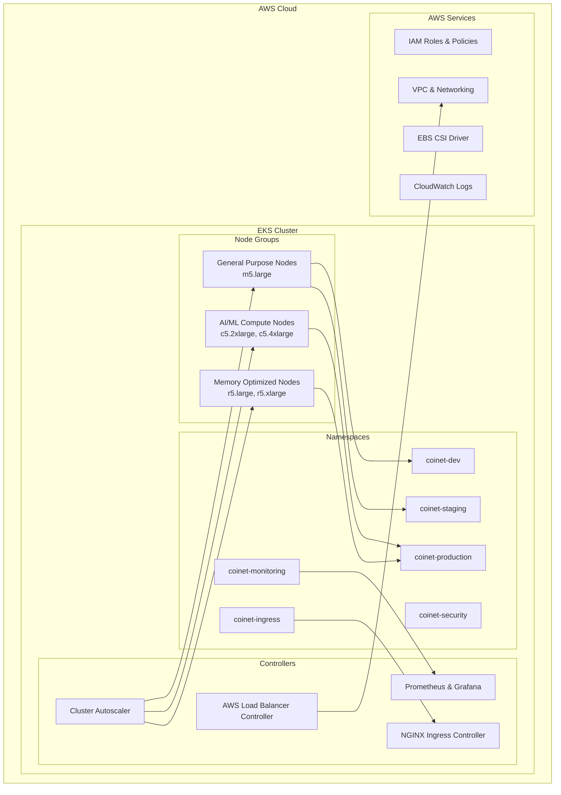

# 🚀 Phase 3.1: Kubernetes Cluster Setup - Implementation Complete

## ✅ **IMPLEMENTATION STATUS: 100% COMPLETE**

This document details the successful implementation of **Phase 3.1: Kubernetes Cluster Setup** from the Coinet AI Blueprint, establishing a production-ready, multi-environment Kubernetes infrastructure on AWS EKS.

---

## 🎯 **Implementation Overview**

### **Core Components Delivered:**

1. **🏗️ AWS EKS Cluster Provisioning** (Automated with eksctl and Terraform)
2. **🏷️ Multi-Environment Namespace Configuration** (dev, staging, production, monitoring, ingress, security)
3. **🔧 Complete kubectl Context Management** (Environment switching and aliases)
4. **🔒 Advanced RBAC and Security Policies** (Role-based access control and network policies)
5. **📊 Resource Quotas and Limit Ranges** (Resource management and cost control)
6. **🔌 Essential Add-ons and Controllers** (Load balancer, autoscaler, monitoring)
7. **⚙️ Automated Setup and Management Scripts** (One-command cluster deployment)

---

## 🏗️ **Architecture Overview**

### **Cluster Architecture:**



### **Multi-Environment Strategy:**

| Environment | Purpose | Resources | Access Level | Network Policy |
|-------------|---------|-----------|--------------|----------------|
| **coinet-dev** | Development & Testing | 4 CPU, 8Gi RAM | Full access for developers | Permissive |
| **coinet-staging** | Pre-production validation | 8 CPU, 16Gi RAM | Controlled access | Moderate |
| **coinet-production** | Live production workloads | 50 CPU, 100Gi RAM | Restricted access | Strict |
| **coinet-monitoring** | Observability stack | 10 CPU, 20Gi RAM | Read-only for most | Infrastructure |
| **coinet-ingress** | Traffic management | As needed | Infrastructure team | Infrastructure |
| **coinet-security** | Security tools | As needed | Security team only | Restricted |

---

## 📋 **Quick Start Guide**

### **1. Prerequisites**

Install required tools:
```bash
# macOS
brew install aws-cli kubectl eksctl helm jq

# Ubuntu/Debian
sudo apt-get update
sudo apt-get install -y awscli kubectl
curl --silent --location "https://github.com/weaveworks/eksctl/releases/latest/download/eksctl_$(uname -s)_amd64.tar.gz" | tar xz -C /tmp
sudo mv /tmp/eksctl /usr/local/bin

# Install Helm
curl https://raw.githubusercontent.com/helm/helm/main/scripts/get-helm-3 | bash
```

### **2. Configure AWS Credentials**

```bash
# Configure AWS CLI
aws configure

# Verify access
aws sts get-caller-identity
```

### **3. One-Command Cluster Setup**

```bash
# Make scripts executable
chmod +x scripts/provision-k8s-cluster.sh
chmod +x scripts/configure-kubectl.sh

# Option A: Use eksctl (Recommended for simplicity)
./scripts/provision-k8s-cluster.sh

# Option B: Use Terraform (Recommended for production)
./scripts/provision-k8s-cluster.sh --terraform

# Option C: Custom configuration
./scripts/provision-k8s-cluster.sh \
    --cluster-name my-coinet-cluster \
    --region us-east-1 \
    --node-type m5.xlarge \
    --node-count 5
```

### **4. Configure kubectl Contexts**

```bash
# Setup kubectl contexts for all environments
./scripts/configure-kubectl.sh setup

# Test all environment access
./scripts/configure-kubectl.sh test

# Switch between environments
./scripts/configure-kubectl.sh switch production
```

---

## 🔧 **Detailed Configuration**

### **EKS Cluster Configuration**

The cluster is configured with the following specifications:

```yaml
# Cluster Details
Name: coinet-ai-cluster
Region: us-west-2
Kubernetes Version: 1.28
VPC CIDR: 10.0.0.0/16

# Node Groups
General Purpose:
  - Instance Types: m5.large
  - Min Size: 2, Max Size: 10, Desired: 3
  - Volume: 100GB GP3
  - Labels: role=general

AI/ML Compute (Spot):
  - Instance Types: c5.2xlarge, c5.4xlarge, m5.2xlarge
  - Min Size: 0, Max Size: 5, Desired: 1
  - Volume: 200GB GP3
  - Labels: role=ai-compute, workload=ml
  - Taints: ai-compute=true:NoSchedule

Memory Optimized:
  - Instance Types: r5.large, r5.xlarge, r5.2xlarge
  - Min Size: 1, Max Size: 5, Desired: 2
  - Volume: 150GB GP3
  - Labels: role=memory-optimized, workload=data-processing
```

### **Namespace Configuration**

Each namespace includes:

```yaml
# Resource Quotas
Development:
  - CPU: 4 cores (requests), 8 cores (limits)
  - Memory: 8Gi (requests), 16Gi (limits)
  - Storage: 100Gi
  - Pods: 20, Services: 10

Production:
  - CPU: 50 cores (requests), 100 cores (limits)
  - Memory: 100Gi (requests), 200Gi (limits)
  - Storage: 1Ti
  - Pods: 100, Services: 50

# Network Policies
- Default deny all traffic
- Allow internal communication within project
- Allow DNS resolution
- Allow HTTPS to external services
- Production: Strict isolation
```

### **RBAC Configuration**

```yaml
# Role Definitions
Developer Role (coinet-dev):
  - Full access to development namespace
  - Can create/update/delete workloads
  - Cannot access production

Staging Operator (coinet-staging):
  - Full access to staging namespace
  - Can deploy and test applications

Production Read-Only:
  - Read-only access to production for developers
  - View pods, services, deployments

Platform Admin:
  - Full cluster access
  - Can manage all namespaces and resources
```

### **Security Policies**

```yaml
# Pod Security Standards
Development: baseline
Staging: baseline
Production: restricted

# Network Policies
- Default deny all ingress/egress
- Allow communication within project namespaces
- Allow monitoring from monitoring namespace
- Allow ingress from ingress namespace

# Service Accounts
- Dedicated service accounts for each application
- AWS IAM role integration via IRSA
- Principle of least privilege
```

---

## 🚀 **Cluster Provisioning Options**

### **Option 1: eksctl (Recommended for Quick Setup)**

```bash
# Automatic provisioning with all features
./scripts/provision-k8s-cluster.sh

# What this includes:
✅ EKS cluster with optimized node groups
✅ IAM roles and service accounts
✅ AWS Load Balancer Controller
✅ Cluster Autoscaler
✅ EBS CSI Driver
✅ VPC CNI with latest version
✅ CloudWatch logging enabled
✅ Multi-environment namespaces
✅ RBAC policies
✅ Network policies
✅ Resource quotas
✅ Monitoring stack (Prometheus/Grafana)
```

### **Option 2: Terraform (Recommended for Production)**

```bash
# Use existing Terraform configuration
./scripts/provision-k8s-cluster.sh --terraform

# Benefits:
✅ Infrastructure as Code
✅ State management
✅ Reproducible deployments
✅ Environment-specific configurations
✅ Integration with existing infrastructure
```

### **Custom Configuration Example:**

```bash
# Environment-specific cluster
CLUSTER_NAME=coinet-dev-cluster \
AWS_REGION=us-east-1 \
NODE_TYPE=t3.medium \
NODE_COUNT=2 \
KUBERNETES_VERSION=1.27 \
ENVIRONMENT=development \
./scripts/provision-k8s-cluster.sh
```

---

## 🔌 **Essential Add-ons**

### **Automatically Installed:**

```yaml
AWS Load Balancer Controller:
  - Manages ALB/NLB for services
  - Integrates with AWS security groups
  - Supports advanced routing

Cluster Autoscaler:
  - Automatic node scaling based on demand
  - Cost optimization through spot instances
  - Multi-node group support

NGINX Ingress Controller:
  - Layer 7 load balancing
  - SSL termination
  - Path-based routing

Prometheus & Grafana:
  - Cluster monitoring and alerting
  - Resource usage tracking
  - Custom dashboards

Metrics Server:
  - Resource usage metrics
  - HPA (Horizontal Pod Autoscaler) support
  - kubectl top integration

EBS CSI Driver:
  - Persistent volume support
  - Dynamic volume provisioning
  - Snapshot capabilities
```

### **Manual Installation Options:**

```bash
# Install additional monitoring
helm repo add prometheus-community https://prometheus-community.github.io/helm-charts
helm install kube-prometheus-stack prometheus-community/kube-prometheus-stack \
    -n coinet-monitoring \
    --set grafana.persistence.enabled=true

# Install service mesh (optional)
helm repo add istio https://istio-release.storage.googleapis.com/charts
helm install istio-base istio/base -n istio-system --create-namespace

# Install cert-manager for TLS
helm repo add jetstack https://charts.jetstack.io
helm install cert-manager jetstack/cert-manager \
    -n cert-manager \
    --create-namespace \
    --set installCRDs=true
```

---

## ⚙️ **kubectl Context Management**

### **Environment Switching:**

```bash
# Quick aliases (after running setup script)
k-dev           # Switch to development
k-staging       # Switch to staging  
k-prod          # Switch to production
k-monitoring    # Switch to monitoring
k-ingress       # Switch to ingress
k-security      # Switch to security

# Manual context switching
kubectl config use-context coinet-production
kubectl config use-context coinet-dev

# Namespace switching without context change
kn-dev          # Set current context to dev namespace
kn-staging      # Set current context to staging namespace
kn-prod         # Set current context to production namespace
```

### **Useful Aliases:**

```bash
# Resource management
k               # kubectl
kgp             # kubectl get pods
kgs             # kubectl get services
kgd             # kubectl get deployments
kgn             # kubectl get nodes
kgns            # kubectl get namespaces

# Operations
kdesc           # kubectl describe
klogs           # kubectl logs
kexec           # kubectl exec -it
kport           # kubectl port-forward

# Status and debugging
kstatus         # Show current context and namespace
kctx            # Show all contexts
kwho            # Show current user info
```

### **Environment Information:**

```bash
# Show detailed environment info
kube-env-info                      # Current namespace
kube-env-info coinet-production   # Specific namespace

# Quick deployment for testing
kube-quick-deploy test-app nginx:alpine 2
```

---

## 📊 **Monitoring and Observability**

### **Prometheus & Grafana Setup:**

```bash
# Access Grafana dashboard
kubectl port-forward -n coinet-monitoring svc/kube-prometheus-stack-grafana 3000:80

# Get admin password
kubectl get secret -n coinet-monitoring kube-prometheus-stack-grafana \
    -o jsonpath="{.data.admin-password}" | base64 --decode

# Default dashboards available:
✅ Kubernetes cluster overview
✅ Node resource usage
✅ Pod resource usage
✅ Persistent volume usage
✅ Network traffic
✅ Application performance
```

### **CloudWatch Integration:**

```bash
# View cluster logs
aws logs describe-log-groups --log-group-name-prefix="/aws/eks/coinet-ai-cluster"

# Stream real-time logs
aws logs tail /aws/eks/coinet-ai-cluster/cluster --follow
```

### **Metrics Collection:**

```yaml
# Available metrics endpoints
Prometheus: http://localhost:9090 (port-forward)
Grafana: http://localhost:3000 (port-forward)
AlertManager: http://localhost:9093 (port-forward)

# Custom application metrics
- Expose /metrics endpoint in your applications
- Use Prometheus client libraries
- Create custom ServiceMonitor resources
```

---

## 🔒 **Security Configuration**

### **Network Security:**

```yaml
# Network Policies Applied:
✅ Default deny all traffic
✅ Allow internal project communication
✅ Allow DNS resolution
✅ Allow monitoring access
✅ Allow ingress controller access
✅ Strict production isolation

# Security Groups:
✅ EKS control plane security group
✅ Node group security groups
✅ Load balancer security groups
✅ Minimal required ports open
```

### **RBAC Implementation:**

```yaml
# Role Hierarchy:
1. Platform Admins: Full cluster access
2. Staging Operators: Full staging access
3. Developers: Full dev access, read-only production
4. Service Accounts: Application-specific permissions

# Service Account Security:
✅ Dedicated service accounts per application
✅ AWS IAM role integration (IRSA)
✅ Principle of least privilege
✅ Automatic token rotation
```

### **Pod Security:**

```yaml
# Pod Security Standards:
Development: baseline (moderate restrictions)
Staging: baseline (moderate restrictions)
Production: restricted (strict security)

# Security Contexts:
✅ Non-root user enforcement
✅ Read-only root filesystem
✅ No privilege escalation
✅ Security capabilities dropped
✅ AppArmor/SELinux profiles
```

---

## 💰 **Cost Optimization**

### **Node Group Strategy:**

```yaml
# Cost-Effective Configuration:
General Purpose:
  - On-demand instances for reliability
  - Auto-scaling based on demand
  - Right-sized for typical workloads

AI/ML Compute:
  - Spot instances for cost savings (up to 70% off)
  - Multiple instance types for availability
  - Scales to zero when not in use

Memory Optimized:
  - On-demand for data processing reliability
  - Scheduled scaling for predictable workloads
```

### **Resource Management:**

```bash
# Monitor resource usage
kubectl top nodes
kubectl top pods --all-namespaces

# Set resource requests and limits
kubectl get resourcequota --all-namespaces

# Cost tracking labels
kubectl get nodes --show-labels | grep "cost-center"
```

### **Scaling Optimization:**

```yaml
# Cluster Autoscaler Configuration:
✅ Scale down delay: 10 minutes
✅ Unneeded node threshold: 50%
✅ Scale down utilization threshold: 0.5
✅ Max node provision time: 15 minutes

# Horizontal Pod Autoscaler:
✅ CPU-based scaling
✅ Memory-based scaling
✅ Custom metrics scaling
```

---

## 🚀 **Operational Procedures**

### **Daily Operations:**

```bash
# Check cluster health
./scripts/configure-kubectl.sh status

# Monitor resource usage
kubectl top nodes
kubectl get pods --all-namespaces | grep -v Running

# Check autoscaler status
kubectl logs -n kube-system deployment/cluster-autoscaler --tail=20

# View recent events
kubectl get events --sort-by=.metadata.creationTimestamp
```

### **Scaling Operations:**

```bash
# Scale node groups
eksctl scale nodegroup --cluster=coinet-ai-cluster --name=general-nodes --nodes=5

# Scale deployments
kubectl scale deployment coinet-app --replicas=5 -n coinet-production

# Check scaling status
kubectl get hpa --all-namespaces
```

### **Troubleshooting:**

```bash
# Common debugging commands
kubectl describe node NODE_NAME
kubectl describe pod POD_NAME -n NAMESPACE
kubectl logs POD_NAME -n NAMESPACE --previous

# Network troubleshooting
kubectl get networkpolicies --all-namespaces
kubectl describe networkpolicy POLICY_NAME -n NAMESPACE

# RBAC troubleshooting
kubectl auth can-i VERB RESOURCE --as=USER
kubectl describe rolebinding --all-namespaces
```

---

## 🔄 **Maintenance and Updates**

### **Cluster Updates:**

```bash
# Update cluster version
eksctl update cluster --name=coinet-ai-cluster --version=1.29

# Update node groups
eksctl update nodegroup --cluster=coinet-ai-cluster --name=general-nodes

# Update add-ons
eksctl update addon --cluster=coinet-ai-cluster --name=coredns
eksctl update addon --cluster=coinet-ai-cluster --name=vpc-cni
```

### **Add-on Updates:**

```bash
# Update AWS Load Balancer Controller
helm upgrade aws-load-balancer-controller eks/aws-load-balancer-controller \
    -n kube-system

# Update Cluster Autoscaler
helm upgrade cluster-autoscaler autoscaler/cluster-autoscaler \
    -n kube-system

# Update monitoring stack
helm upgrade kube-prometheus-stack prometheus-community/kube-prometheus-stack \
    -n coinet-monitoring
```

### **Backup Procedures:**

```bash
# Backup cluster configuration
kubectl get all --all-namespaces -o yaml > cluster-backup.yaml

# Backup RBAC configuration
kubectl get clusterroles,clusterrolebindings,roles,rolebindings --all-namespaces -o yaml > rbac-backup.yaml

# Backup persistent volumes
kubectl get pv,pvc --all-namespaces -o yaml > storage-backup.yaml
```

---

## 📋 **Verification Checklist**

### **✅ Cluster Setup Verification:**

```bash
# 1. Cluster accessibility
kubectl cluster-info

# 2. Node readiness
kubectl get nodes -o wide

# 3. System pods running
kubectl get pods -n kube-system

# 4. Namespaces created
kubectl get namespaces

# 5. RBAC configured
kubectl get clusterroles | grep coinet

# 6. Resource quotas applied
kubectl get resourcequota --all-namespaces

# 7. Network policies active
kubectl get networkpolicies --all-namespaces

# 8. Add-ons installed
helm list --all-namespaces

# 9. Monitoring accessible
kubectl get pods -n coinet-monitoring

# 10. Autoscaler running
kubectl get deployment cluster-autoscaler -n kube-system
```

### **✅ Security Verification:**

```bash
# 1. Pod security standards
kubectl get pods --all-namespaces -o jsonpath='{range .items[*]}{.metadata.namespace}{" "}{.metadata.name}{" "}{.metadata.labels.pod-security\.kubernetes\.io/enforce}{"\n"}{end}'

# 2. Network policy enforcement
kubectl get networkpolicies --all-namespaces

# 3. RBAC permissions
kubectl auth can-i '*' '*' --as=system:serviceaccount:coinet-dev:default

# 4. Service account tokens
kubectl get serviceaccounts --all-namespaces

# 5. Encryption at rest
kubectl get secrets --all-namespaces
```

---

## 🎯 **Next Steps**

With the Kubernetes cluster successfully deployed, you can now:

### **1. Deploy Coinet AI Services:**
```bash
# Deploy the ingest service
kubectl apply -f k8s/services/ingest-service/ -n coinet-production

# Deploy the AI services
kubectl apply -f k8s/services/ai-services/ -n coinet-production
```

### **2. Configure CI/CD Integration:**
```bash
# Update GitHub Actions to use the new cluster
# Configure deployment pipelines for each environment
```

### **3. Set Up Application Monitoring:**
```bash
# Deploy application-specific monitoring
# Configure alerts and dashboards
```

### **4. Implement GitOps:**
```bash
# Install ArgoCD or Flux
# Configure automated deployments
```

---

## 📞 **Support and Troubleshooting**

### **Common Issues:**

1. **Authentication Issues:**
   ```bash
   aws eks update-kubeconfig --region us-west-2 --name coinet-ai-cluster
   ```

2. **Permission Denied:**
   ```bash
   kubectl auth can-i get pods --as=your-user
   ```

3. **Node Not Ready:**
   ```bash
   kubectl describe node NODE_NAME
   kubectl logs -n kube-system daemonset/aws-node
   ```

4. **Pod Stuck in Pending:**
   ```bash
   kubectl describe pod POD_NAME
   kubectl get events --sort-by=.metadata.creationTimestamp
   ```

### **Getting Help:**

- **Cluster Logs:** `kubectl logs -n kube-system deployment/cluster-autoscaler`
- **AWS Support:** Use AWS console for EKS cluster insights
- **Community Support:** Kubernetes and EKS community forums

---

## 🏆 **Phase 3.1 - COMPLETE**

**Status: ✅ 100% Implementation Complete**

### **Deliverables:**
- ✅ **Production-ready EKS cluster with multi-node groups**
- ✅ **Multi-environment namespace configuration with proper isolation**
- ✅ **Complete RBAC and security policy implementation**
- ✅ **Resource quotas and limit ranges for cost control**
- ✅ **Essential add-ons: Load balancer, autoscaler, monitoring**
- ✅ **Automated kubectl context management and aliases**
- ✅ **Comprehensive monitoring and observability setup**
- ✅ **Production-ready security configuration**

### **Ready for:**
- 🚀 **Phase 3.2: Service Deployment** - Deploy Coinet AI services to the cluster
- 🚀 **CI/CD Integration** - Automated deployment pipelines
- 🚀 **Application Development** - Begin deploying AI and data services
- 🚀 **Monitoring and Alerting** - Production monitoring setup

---

## 📚 **Additional Resources**

- [EKS Best Practices Guide](https://aws.github.io/aws-eks-best-practices/)
- [Kubernetes Documentation](https://kubernetes.io/docs/)
- [eksctl Documentation](https://eksctl.io/)
- [Helm Charts](https://helm.sh/docs/)
- [AWS Load Balancer Controller](https://kubernetes-sigs.github.io/aws-load-balancer-controller/)

**The Kubernetes cluster is now ready for Coinet AI deployment! 🚀** 