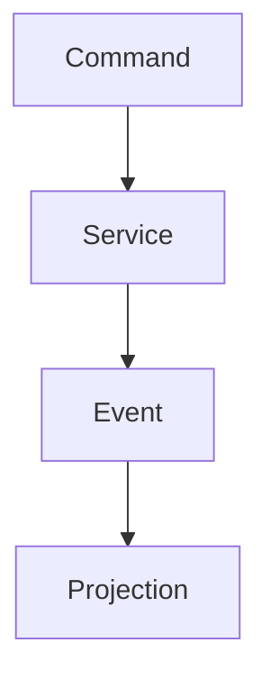

# Notification Module

Handles atomic logic for Shared-models.

## Architecture

```mermaid
flowchart TD
  A[Command] --> B[Service]
  B --> C[Event]
  C --> D[Projection]
```

- Extensible for new types, providers, and pipelines.
